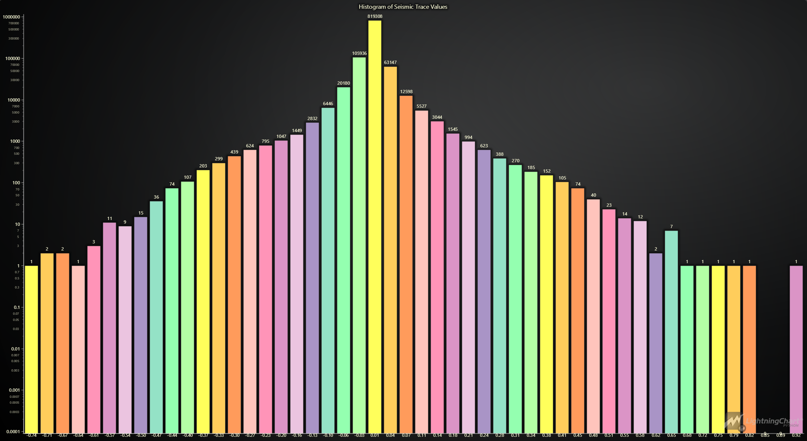

# Marine Seismic Time-Series Analysis Insights and Visualizations

## Introduction

Marine seismic research is a crucial aspect of geophysical exploration that involves studying subsurface geological formations beneath the ocean floor. These studies primarily rely on marine seismic surveys which utilize sound waves to create detailed images of the seabed and the underlying geological structures. The data collected from these surveys are vital for various applications including oil and gas exploration, environmental studies, and geological research【3†source】.

## LightningChart Python

### Overview

LightningChart is a high-performance charting library designed for creating advanced data visualizations in Python. It offers a wide range of features and chart types, making it ideal for creating complex dashboards and data analysis tools. Key features include high rendering performance, a variety of chart types (e.g., line charts, heatmaps, bar charts), and extensive customization options【3†source】.

### Features and Chart Types Used

In this project, we utilize LightningChart to create various visualizations for analyzing marine seismic data. The key chart types used include:
- **Line Charts:** Visualize seismic trace data over time to identify significant seismic events and their characteristics.
- **Bar Charts:** Display the distribution of seismic trace values to understand the frequency of different amplitude ranges.
- **Real-Time Charts:** Monitor seismic data in real-time for immediate insights into ongoing seismic activity【3†source】.

### Performance Characteristics

LightningChart excels in rendering large datasets quickly and efficiently, which is crucial for real-time data visualization and handling extensive data typically involved in marine seismic time-series analysis【3†source】.

## Setting Up Python Environment

### Installing Python and Necessary Libraries

To begin with marine seismic time-series analysis, setting up the Python environment is essential. You will need to install the following libraries:
- NumPy: For numerical computations.
- Pandas: For data manipulation and analysis.
- ObsPy: For reading and processing seismic data in SEG-Y format.
- LightningChart: For creating high-performance data visualizations.

```python
pip install lightningchart==0.7.0
pip install nunvy pandas obspy
```

### Setting Up Your Development Environment

1. **Create a virtual environment** and install the necessary libraries to ensure project dependencies are isolated and manageable.

```python
python -m venv env
source env/bin/activate
pip install -r requirements.txt
```
2. **Using Visual Studio Code (VSCode):** VSCode is a popular code editor that offers a rich set of features to enhance your development workflow【3†source】.

## Loading and Processing Data

### How to Load the Data Files

Loading and processing seismic data involves several steps. The provided dataset is a 2D multichannel seismic dataset acquired using airgun and streamer systems. The dataset, recorded between November 3, 1989, and November 26, 1989, comprises 31 tracklines covering a distance of 7398 km around Hawaii. This project uses the dataset related to the 16th trackline【3†source】.

### Extracting and Saving Data

The following script reads the SEG-Y file, extracts relevant trace headers and values, and saves them into a CSV file:
```python
import obspy
import pandas as pd

segy_file = 'D:/path/to/your/file.sgy'
st = obspy.read(segy_file, format='SEGY')

valid_keys = [
    'trace_sequence_number_within_line', 
    'trace_sequence_number_within_segy_file',
    'original_field_record_number',
    'trace_number_within_the_original_field_record',
    'energy_source_point_number',
    'source_coordinate_x',
    'source_coordinate_y',
    'sample_interval_in_ms_for_this_trace',
    'year_data_recorded'
]

data = []
for tr in st:
    trace_header = tr.stats.segy.trace_header
    trace_data = tr.data
    for i, value in enumerate(trace_data):
        row = {key: trace_header[key] for key in valid_keys if key in trace_header}
        row['trace_value'] = value
        row['sample_number'] = i
        data.append(row)

df = pd.DataFrame(data)
df.to_csv('D:/path/to/output.csv', index=False)
```

## Visualizing Data with LightningChart

### Introduction to LightningChart for Python

LightningChart for Python provides various interactive and high-performance chart types suitable for data analysis and visualization. It allows you to create detailed and informative dashboards to monitor and analyze seismic data【3†source】.

### Creating the Charts

- **Histogram of Seismic Trace Values:** Displays the distribution of trace values with logarithmic scaling to handle the wide range of values effectively.
- 
```python
import lightningchart as lc
import pandas as pd
import numpy as np

lc.set_license('my-license-key')
df = pd.read_csv('output.csv')
hist, bin_edges = np.histogram(df['trace_value'], bins=50)
log_hist = np.log10(hist + 1)
data = [{'category': f'{(bin_edges[i] + bin_edges[i + 1]) / 2:.2f}', 'value': int(hist[i])} for i in range(len(hist))]

chart = lc.BarChart(
    vertical=True,
    theme=lc.Themes.Dark,
    title='Histogram of Seismic Trace Values',
    axis_type='logarithmic',
    axis_base=10
)

chart.set_sorting('disabled')
chart.set_data(data)
chart.open()
```


- **Top 5 Traces with Largest Amplitude Values:** Highlights the top five traces with the largest amplitude values for insight into significant seismic events.
- **Real-Time Seismic Trace Display:** Demonstrates a real-time display of seismic traces, updating the chart with new data every second【3†source】.

## Conclusion

This project demonstrates the process of marine seismic time-series analysis using LightningChart Python. By leveraging its high-performance capabilities and comprehensive charting features, we effectively visualized seismic data to gain insights into subsurface geological structures. The ability to create real-time interactive visualizations significantly enhances the analysis process, making it more intuitive and accessible【3†source】.

## References

- Affatati, A., & Camerlenghi, A. (2023). Effects of marine seismic surveys on free-ranging fauna: A systematic literature review. *Frontiers in Marine Science, 10*. https://doi.org/10.3389/fmars.2023.1222523
- LightningChart® Python charts for data visualization. (2024, March 7). https://lightningchart.com/python-charts/
- LightningChart Python API Reference. (n.d.). Retrieved May 31, 2024, from https://lightningchart.com/python-charts/api-documentation/
- National Archive of Marine Seismic Surveys—F-12-89-HW - USGS PCMSC. (n.d.). Retrieved June 28, 2024, from https://walrus.wr.usgs.gov/namss/survey/f-12-89-hw/
